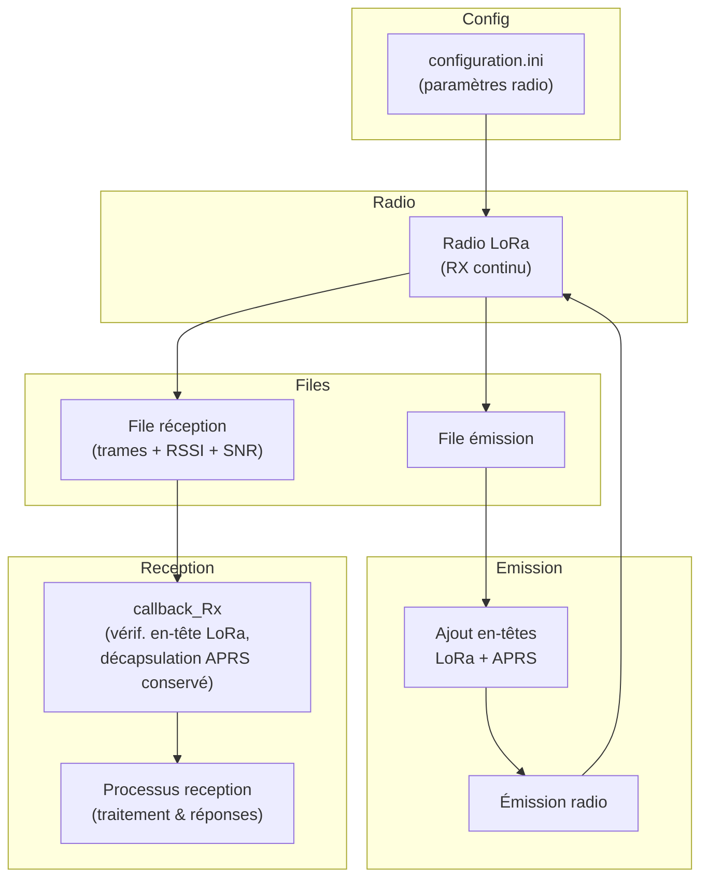

# Programme `lora_files`

Le programme **lora_files** assure la gestion de l’émission et de la réception des trames LoRa selon les étapes suivantes :

## 1. Paramétrage de la radio
- La radio est configurée à partir des paramètres définis dans le fichier :  `/home/ballon/configuration.ini`
- Ouverture de deux files de messages :  
- une pour **l’émission**,  
- une pour **la réception**.  
- La radio est placée en **mode réception continue**.

## 2. Boucle d’attente et émission des trames
- Le programme attend passivement les trames présentes dans la file d’émission.  
- Pour chaque trame retirée de la file :  
1. Ajout des en-têtes **LoRa** et **APRS**.  
2. Passage du module radio en **mode émission**.  
3. Transmission de la trame avec ses en-têtes.  
4. Retour du module radio en **mode réception continue**.  

## 3. Réception d’une trame
- À la réception complète d’une trame, le module radio génère une **interruption** qui interrompt la boucle principale.  
- La fonction `callback_Rx` est exécutée :  
- Vérification de l’en-tête **LoRa**.  
- Décapsulation : retrait de l’en-tête LoRa (l’en-tête **APRS** est conservé).  
- La trame ainsi décapsulée, accompagnée du **RSSI** et du **SNR**, est insérée dans la file de réception.  
- Le traitement de cette file est délégué au processus indépendant **`reception`**, chargé de traiter et de répondre aux requêtes.

## 5.Schéma de fonctionnement

## 6. Installation du service

1.  Copier le fichier  `lora_files.service`  dans le répertoire :  `/etc/systemd/system/`

`~/lora_files $ sudo cp lora_files.service /etc/systemd/system/`

3.  Recharger systemd et activer le service

`sudo systemctl daemon-reload`

`sudo systemctl enable lora_files.service`

`sudo systemctl start lora_files.service`

👉 Attention toutefois : la commande `enable` **n’active pas le service immédiatement**, elle programme juste son lancement au boot. c'est pourquoi elle est suivi de la commande `start`

3.  Vérifier que le service est actif

`sudo systemctl status lora_files.service`

## 7. Consultation des logs

`journalctl -fu lora_files.service`

# Changelog

**25/08/2025** :  Création du README.md 

> **Notes :**

> - Licence : **licence publique générale** 
> - Auteur  **Philippe SIMIER  - F4JRE**
>  
<!-- TOOLBOX 

Génération des badges : https://shields.io/
Génération de ce fichier : https://stackedit.io/editor#

